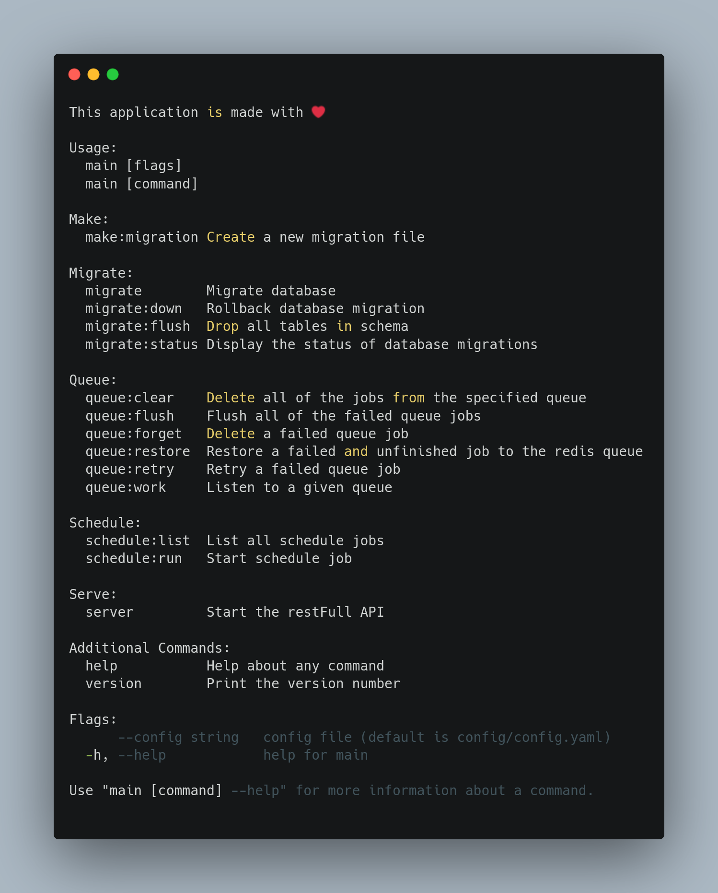

# go-restfull :rocket:

[](https://goreportcard.com/report/github.com/turahe/go-restfull)
[](https://go.dev/)
[](https://github.com/turahe/go-restfull/blob/main/LICENSE)
[](https://github.com/turahe/go-restfull)
[](https://www.docker.com/)
[](https://www.postgresql.org/)
[](https://redis.io/)

A modern, production-ready Go REST API boilerplate built with hexagonal architecture, featuring comprehensive authentication, RBAC, and enterprise-grade features.

This boilerplate is intended to be used as a starting point for a Go application. It provides a solid foundation with best practices, clean architecture, and essential features for building scalable REST APIs.

<p align="center">

</p>

## 🚀 Features

- **Hexagonal Architecture** - Clean separation of concerns with domain-driven design
- **JWT Authentication** - Secure token-based authentication system
- **RBAC (Role-Based Access Control)** - Fine-grained permission management
- **PostgreSQL** - Robust relational database with migrations
- **Redis Cache** - High-performance caching layer
- **Fiber Router** - Fast HTTP framework with middleware support
- **Docker Support** - Containerized deployment ready
- **Comprehensive Testing** - Unit, integration, and API tests
- **CLI Commands** - Powerful command-line interface with Cobra
- **Scheduler** - Cron job scheduling capabilities
- **Logging** - Structured logging with Zap
- **API Documentation** - Swagger/OpenAPI documentation
- **Database Seeding** - Development data seeding system

## 📋 Prerequisites

- **Go 1.20+** - Latest stable version recommended
- **Docker & Docker Compose** - For containerized development
- **PostgreSQL 13+** - Database (included in Docker setup)
- **Redis 6+** - Caching layer (included in Docker setup)
- **Sonar-scanner** - For code quality analysis (optional)
   ```sh
   brew install sonar-scanner
   ```

## 🛠️ Installation

1. **Clone the repository**
   ```sh
   git clone https://github.com/turahe/go-restfull.git
   cd go-restfull
   ```

2. **Install Go dependencies**
   ```sh
   go mod download
   ```

3. **Configure the application**
   ```sh
   cp config/config.example.yaml config/config.yaml
   # Edit config/config.yaml with your settings
   ```

4. **Start the infrastructure**
   ```sh
   docker compose up -d
   ```

5. **Run database migrations**
   ```sh
   go run main.go migrate
   ```

6. **Seed the database (optional)**
   ```sh
   go run main.go seed
   ```

7. **Start the application**
   ```sh
   # Development mode
   go run main.go serve-api

   # With hot reload (requires air)
   air serve-api
   ```

## 🗄️ Database Management

### Migration Commands

```sh
# Apply all migrations
go run main.go migrate

# Roll back the last migration
go run main.go migrate:down

# Roll back multiple migrations (replace N with number of steps)
go run main.go migrate:down --step N

# Drop all tables and reset schema (use with caution!)
go run main.go migrate:flush
```

### Seeding Commands

```sh
# Seed all data
go run main.go seed

# Seed specific data
go run main.go seed --type=users
go run main.go seed --type=posts
```

## 🧪 Testing

```sh
# Run unit tests
make unit-test

# Run API integration tests
make api-test

# Run all tests with coverage
make test

# Code quality analysis (requires sonar-scanner)
make sonar
```

## 📁 Project Structure

```
├── cmd/                    # CLI commands
├── config/                 # Configuration files
├── docs/                   # Documentation and API specs
├── internal/               # Application code
│   ├── application/        # Application services
│   ├── domain/            # Domain entities and business logic
│   ├── infrastructure/    # External adapters (DB, external APIs)
│   └── interfaces/        # HTTP controllers and routes
├── pkg/                   # Shared packages
└── main.go               # Application entry point
```

## ⚙️ Configuration

The application uses YAML configuration with the following key files:

- `config/config.yaml` - Main configuration (gitignored)
- `config/config.example.yaml` - Example configuration
- `config/rbac_model.conf` - RBAC model configuration
- `config/rbac_policy.csv` - RBAC policy definitions

## 🔧 Development

### Coding Standards

1. **Constants**: Use capitalized SNAKE_CASE for public constants, underscore prefix for private

   **Good Example**
   ```go
   // Public constants
   const BAD_REQUEST int = 400
   const UNAUTHORIZED int = 401

   // Private constants
   const _INTERNAL_ERROR int = 500
   ```

   **Bad Example**
   ```go
   const BadRequest int = 400
   const unauthorized int = 401
   ```

2. **File Organization**: Follow hexagonal architecture principles
3. **Error Handling**: Use structured error responses
4. **Logging**: Use structured logging with appropriate levels

### Key Directories

- `internal/application/` - Application services and ports
- `internal/domain/` - Business entities and domain logic
- `internal/infrastructure/` - Database adapters and external services
- `internal/interfaces/http/` - HTTP controllers and routing
- `cmd/` - CLI command implementations

## 🚀 Deployment

### Docker Deployment

```sh
# Build the application
docker build -t go-restfull .

# Run with Docker Compose
docker compose up -d
```

### Environment Variables

Key environment variables (see `config/config.example.yaml`):

- `DB_HOST` - Database host
- `DB_PORT` - Database port
- `DB_NAME` - Database name
- `DB_USER` - Database user
- `DB_PASSWORD` - Database password
- `JWT_SECRET` - JWT signing secret
- `REDIS_URL` - Redis connection string

## 📚 API Documentation

- **Swagger UI**: Available at `/swagger/index.html` when running
- **API Specs**: Located in `docs/swagger.yaml`
- **Health Check**: `/healthz` endpoint for monitoring

## 🤝 Contributing

1. Fork the repository
2. Create a feature branch (`git checkout -b feature/amazing-feature`)
3. Commit your changes (`git commit -m 'Add amazing feature'`)
4. Push to the branch (`git push origin feature/amazing-feature`)
5. Open a Pull Request

## 📄 License

This project is licensed under the MIT License - see the [LICENSE](LICENSE) file for details.

## 🗺️ Roadmap

- [ ] Add gRPC API support
- [ ] Implement WebSocket functionality
- [ ] Add GraphQL support
- [ ] Enhanced monitoring and metrics
- [ ] Multi-tenant support
- [ ] Advanced caching strategies
- [ ] API rate limiting
- [ ] Enhanced security features

## 🙏 Acknowledgments

- [Fiber](https://gofiber.io/) - Fast HTTP framework
- [Zap](https://github.com/uber-go/zap) - Structured logging
- [Cobra](https://github.com/spf13/cobra) - CLI framework
- [Casbin](https://casbin.org/) - Authorization library

