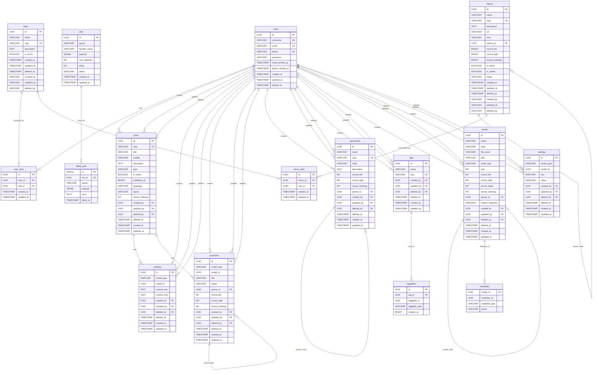

# Database Entity Relationship Diagram (ERD)

This document contains the Entity Relationship Diagram for the Go RESTful API database schema using Mermaid syntax.

## Complete Database Schema

## Key Features

### 1. **User Management System**
- **users**: Core user accounts with authentication fields
- **roles**: Role definitions for RBAC (Role-Based Access Control)
- **user_roles**: Many-to-many relationship between users and roles

### 2. **Content Management System**
- **posts**: Blog posts and articles with polymorphic content
- **contents**: Rich content storage with raw and HTML versions
- **comments**: Hierarchical comment system with nested comments support

### 3. **Taxonomy System**
- **taxonomies**: Hierarchical categorization (categories, etc.)
- **tags**: Simple tagging system
- **taggables**: Polymorphic tagging for any entity

### 4. **Media Management**
- **media**: File storage with hierarchical organization
- **mediables**: Polymorphic media attachments

### 5. **Menu System**
- **menus**: Hierarchical navigation menus
- **menu_roles**: Role-based menu access control

### 6. **Configuration**
- **settings**: Flexible key-value configuration system

### 7. **Job Queue**
- **jobs**: Background job processing
- **failed_jobs**: Failed job tracking

## Design Patterns

### 1. **Polymorphic Associations**
- `contents` table uses `model_type` and `model_id` for polymorphic relationships
- `comments` table supports comments on any entity
- `taggables` table enables tagging of any entity
- `mediables` table allows media attachments to any entity
- `settings` table supports entity-specific settings

### 2. **Hierarchical Data**
- **Nested Set Model**: Used in `taxonomies`, `menus`, and `media` tables with `record_left`, `record_right`, and `record_ordering` fields
- **Adjacency List**: Used in `comments` table with `parent_id` field

### 3. **Audit Trail**
- All major tables include `created_by`, `updated_by`, `deleted_by` fields
- Soft deletes with `deleted_at` timestamps
- Standard `created_at` and `updated_at` timestamps

### 4. **RBAC Implementation**
- Role-based access control through `roles`, `user_roles`, and `menu_roles` tables
- Menu access control based on user roles

## Database Constraints

### Primary Keys
- All tables use UUID primary keys for scalability and security

### Foreign Keys
- Proper foreign key constraints with appropriate cascade rules
- User references use `ON DELETE SET NULL` for audit trail preservation

### Unique Constraints
- Email and username uniqueness in users table
- Slug uniqueness in content tables
- Composite unique constraints for many-to-many relationships

### Check Constraints
- Menu table has constraints for nested set model integrity
- Status field constraints in jobs table

## Indexes
- Queue and status indexes on jobs table for performance
- Queue index on failed_jobs table
- Implicit indexes on primary keys and foreign keys

This ERD represents a comprehensive content management system with user management, role-based access control, hierarchical data structures, and background job processing capabilities. 