# Database Entity Relationship Diagram (ERD)

## Overview

This document provides a visual representation of the database schema using Mermaid syntax. The diagram shows all tables, their relationships, and key attributes for the Go RESTful application.

## Mermaid ERD Diagram

```mermaid
erDiagram
    %% Core User Management
    users {
        uuid id PK
        varchar username UK
        varchar email UK
        varchar phone UK
        varchar password
        timestamp email_verified_at
        timestamp phone_verified_at
        timestamp created_at
        timestamp updated_at
        timestamp deleted_at
    }

    roles {
        uuid id PK
        varchar name
        varchar slug UK
        text description
        boolean is_active
        timestamp created_at
        timestamp updated_at
        timestamp deleted_at
        varchar created_by
        varchar updated_by
        varchar deleted_by
    }

    role_entities {
        uuid id PK
        uuid entity_id FK
        varchar entity_type
        uuid role_id FK
        timestamp created_at
        timestamp updated_at
    }

    %% Content Management
    posts {
        uuid id PK
        varchar slug UK
        varchar title
        varchar subtitle
        text description
        varchar type
        boolean is_sticky
        bigint published_at
        varchar language
        varchar layout
        int record_ordering
        uuid created_by FK
        uuid updated_by FK
        uuid deleted_by FK
        timestamp created_at
        timestamp updated_at
        timestamp deleted_at
    }

    contents {
        uuid id PK
        varchar model_type
        uuid model_id
        text content_raw
        text content_html
        uuid created_by FK
        uuid updated_by FK
        uuid deleted_by FK
        timestamp created_at
        timestamp updated_at
        timestamp deleted_at
    }

    taxonomies {
        uuid id PK
        varchar name
        varchar slug UK
        varchar code
        text description
        bigint record_left
        bigint record_right
        bigint record_depth
        bigint record_ordering
        uuid parent_id FK
        uuid created_by FK
        uuid updated_by FK
        uuid deleted_by FK
        timestamp created_at
        timestamp updated_at
        timestamp deleted_at
    }

    tags {
        uuid id PK
        varchar name
        varchar slug UK
        text description
        varchar color
        uuid created_by FK
        uuid updated_by FK
        uuid deleted_by FK
        timestamp created_at
        timestamp updated_at
        timestamp deleted_at
    }

    taggables {
        uuid id PK
        uuid tag_id FK
        uuid taggable_id
        varchar taggable_type
        bigint created_at
    }

    %% Media Management
    media {
        uuid id PK
        varchar name
        varchar hash
        varchar file_name
        varchar disk
        varchar mime_type
        int size
        bigint record_left
        bigint record_right
        bigint record_depth
        bigint record_ordering
        uuid parent_id FK
        varchar custom_attributes
        uuid created_by FK
        uuid updated_by FK
        uuid deleted_by FK
        timestamp created_at
        timestamp updated_at
        timestamp deleted_at
    }

    mediables {
        uuid media_id FK
        uuid mediable_id
        varchar mediable_type
        varchar group
    }

    %% Communication System
    comments {
        uuid id PK
        varchar model_type
        uuid model_id
        varchar title
        varchar status
        uuid parent_id FK
        bigint record_left
        bigint record_right
        bigint record_depth
        bigint record_ordering
        uuid created_by FK
        uuid updated_by FK
        uuid deleted_by FK
        timestamp created_at
        timestamp updated_at
        timestamp deleted_at
    }

    %% Navigation System
    menus {
        uuid id PK
        varchar name
        varchar slug UK
        text description
        varchar url
        varchar icon
        uuid parent_id FK
        bigint record_left
        bigint record_right
        bigint record_depth
        bigint record_ordering
        boolean is_active
        boolean is_visible
        varchar target
        timestamp created_at
        timestamp updated_at
        timestamp deleted_at
        varchar created_by
        varchar updated_by
        varchar deleted_by
    }

    menu_entities {
        uuid menu_id FK
        uuid entity_id
        varchar entity_type
        timestamp created_at
        timestamp updated_at
    }

    %% Organization Management
    organizations {
        uuid id PK
        varchar name
        text description
        varchar code UK
        varchar type
        varchar status
        uuid parent_id FK
        bigint record_left
        bigint record_right
        bigint record_depth
        bigint record_ordering
        timestamp created_at
        timestamp updated_at
        timestamp deleted_at
    }

    %% Configuration Management
    settings {
        uuid id PK
        varchar model_type
        uuid model_id
        varchar key
        varchar value
        uuid created_by FK
        uuid updated_by FK
        uuid deleted_by FK
        timestamp created_at
        timestamp updated_at
        timestamp deleted_at
    }

    %% Address Management
    addresses {
        uuid id PK
        uuid addressable_id
        varchar addressable_type
        varchar address_line1
        varchar address_line2
        varchar city
        varchar state
        varchar province
        varchar regency
        varchar district
        varchar sub_district
        varchar village
        varchar street
        varchar ward
        varchar postal_code
        varchar country
        decimal latitude
        decimal longitude
        boolean is_primary
        varchar address_type
        timestamp created_at
        timestamp updated_at
        timestamp deleted_at
    }

    %% Activity Tracking
    activities {
        uuid id PK
        uuid user_id FK
        varchar action
        varchar model_type
        uuid model_id
        text description
        jsonb properties
        timestamp created_at
        timestamp updated_at
        timestamp deleted_at
    }

    %% Relationships

    %% User-Role Relationships
    users ||--o{ role_entities : "has"
    roles ||--o{ role_entities : "assigned_to"
    role_entities }o--|| users : "entity_id"
    role_entities }o--|| roles : "role_id"

    %% User-Creation Relationships
    users ||--o{ posts : "creates"
    users ||--o{ contents : "creates"
    users ||--o{ taxonomies : "creates"
    users ||--o{ tags : "creates"
    users ||--o{ media : "creates"
    users ||--o{ comments : "creates"
    users ||--o{ menus : "creates"
    users ||--o{ organizations : "creates"
    users ||--o{ settings : "creates"
    users ||--o{ addresses : "has"
    users ||--o{ activities : "performs"

    %% User-Update Relationships
    users ||--o{ posts : "updates"
    users ||--o{ contents : "updates"
    users ||--o{ taxonomies : "updates"
    users ||--o{ tags : "updates"
    users ||--o{ media : "updates"
    users ||--o{ comments : "updates"
    users ||--o{ menus : "updates"
    users ||--o{ organizations : "updates"
    users ||--o{ settings : "updates"
    users ||--o{ addresses : "updates"

    %% User-Delete Relationships
    users ||--o{ posts : "deletes"
    users ||--o{ contents : "deletes"
    users ||--o{ taxonomies : "deletes"
    users ||--o{ tags : "deletes"
    users ||--o{ media : "deletes"
    users ||--o{ comments : "deletes"
    users ||--o{ menus : "deletes"
    users ||--o{ organizations : "deletes"
    users ||--o{ settings : "deletes"
    users ||--o{ addresses : "deletes"

    %% Hierarchical Relationships (Nested Set Model)
    organizations ||--o{ organizations : "parent_child"
    taxonomies ||--o{ taxonomies : "parent_child"
    menus ||--o{ menus : "parent_child"
    media ||--o{ media : "parent_child"
    comments ||--o{ comments : "parent_child"

    %% Content Relationships
    posts ||--o{ contents : "has"
    posts ||--o{ taggables : "tagged_with"
    posts ||--o{ comments : "has"
    posts ||--o{ mediables : "has"

    %% Tag Relationships
    tags ||--o{ taggables : "applied_to"

    %% Media Relationships
    media ||--o{ mediables : "attached_to"

    %% Menu Relationships
    menus ||--o{ menu_entities : "associated_with"

    %% Polymorphic Relationships
    %% Comments can be attached to any entity
    %% Contents can store content for any entity
    %% Settings can be configured for any entity
    %% Addresses can be associated with any entity
    %% Media can be attached to any entity
    %% Tags can be applied to any entity

    %% Activity Relationships
    activities }o--|| users : "performed_by"

    %% Notes
    %% All entities implement soft delete pattern
    %% All entities have audit trail (created_at, updated_at, created_by, updated_by)
    %% Nested Set Model fields: record_left, record_right, record_depth, record_ordering
    %% Polymorphic fields: model_type, model_id for flexible associations
```

## Key Design Patterns

### 1. **Nested Set Model (NSM)**
Tables with hierarchical structures implement the Nested Set Model:
- `organizations`: Company hierarchy
- `taxonomies`: Content classification
- `menus`: Navigation structure
- `media`: File organization
- `comments`: Threaded discussions

**NSM Fields:**
- `record_left`: Left boundary value
- `record_right`: Right boundary value
- `record_depth`: Depth level
- `record_ordering`: Display order

### 2. **Polymorphic Associations**
Flexible entity relationships through:
- `model_type`: Entity type identifier
- `model_id`: Entity UUID reference

**Polymorphic Tables:**
- `comments`: Attachable to any entity
- `contents`: Content storage for any entity
- `settings`: Configuration for any entity
- `addresses`: Geographic location for any entity
- `mediables`: Media attachments for any entity
- `taggables`: Tagging for any entity

### 3. **Audit Trail Pattern**
Comprehensive tracking across all entities:
- `created_at`: Creation timestamp
- `updated_at`: Last modification timestamp
- `created_by`: Creator user reference
- `updated_by`: Last modifier user reference
- `deleted_at`: Soft delete timestamp
- `deleted_by`: Deletion user reference

### 4. **Soft Delete Pattern**
Data preservation through soft deletion:
- Records remain in database
- Excluded from normal queries
- Maintains referential integrity
- Supports audit and compliance requirements

## Relationship Types

### **One-to-Many (1:N)**
- User → Posts, Contents, Comments, etc.
- Organization → Child Organizations
- Taxonomy → Child Taxonomies
- Menu → Child Menus
- Media → Child Media
- Comment → Child Comments

### **Many-to-Many (M:N)**
- Users ↔ Roles (through `role_entities`)
- Tags ↔ Content (through `taggables`)
- Media ↔ Content (through `mediables`)
- Menus ↔ Entities (through `menu_entities`)

### **Self-Referencing**
- Organizations (hierarchical structure)
- Taxonomies (classification hierarchy)
- Menus (navigation hierarchy)
- Media (file organization)
- Comments (threaded discussions)

## Indexing Strategy

### **Primary Indexes**
- UUID primary keys on all tables
- Unique constraints on business identifiers

### **Performance Indexes**
- Foreign key relationships
- Nested Set Model fields
- Status and type fields
- Timestamp fields for audit queries
- Composite indexes for polymorphic queries

### **Query Optimization**
- Nested Set Model for hierarchical queries
- Polymorphic query optimization
- Soft delete filtering
- Audit trail performance

## Data Integrity

### **Constraints**
- Primary key constraints
- Foreign key referential integrity
- Unique constraints on business fields
- Check constraints for data validation
- Not null constraints on required fields

### **Validation Rules**
- Status field enumeration
- Type field validation
- Geographic coordinate precision
- HTML target validation
- Address type validation

## Security Features

### **Access Control**
- Role-based permissions
- User authentication
- Activity logging
- Audit trail maintenance

### **Data Protection**
- Password hashing
- Soft delete for data retention
- Comprehensive audit logging
- Constraint-based validation

## Performance Considerations

### **Query Optimization**
- Nested Set Model efficiency
- Proper indexing strategy
- Polymorphic query optimization
- Soft delete filtering

### **Scalability**
- UUID primary keys
- Efficient hierarchical queries
- Optimized polymorphic associations
- Comprehensive indexing

## Maintenance Considerations

### **Regular Tasks**
- Index maintenance and analysis
- Constraint validation
- Performance monitoring
- Query optimization

### **Monitoring**
- Query performance analysis
- Index usage statistics
- Constraint validation
- Data integrity checks

This ERD provides a comprehensive view of the database schema, showing all tables, their relationships, and the design patterns used to create a scalable and maintainable system.
