# Database Visual ERD - Simplified View

## Overview

This document provides a simplified visual representation of the database schema, focusing on the main entities and their relationships for easier understanding.

## Simplified Entity Relationship Diagram

```mermaid
graph TB
    %% Core Entities
    USERS[👥 Users<br/>Core Accounts]
    ROLES[🔐 Roles<br/>Permissions]
    ORGANIZATIONS[🏢 Organizations<br/>Company Structure]
    
    %% Content Entities
    POSTS[📝 Posts<br/>Articles/Blog]
    CONTENTS[📄 Contents<br/>Raw + HTML]
    TAXONOMIES[🏷️ Taxonomies<br/>Classification]
    TAGS[🏷️ Tags<br/>Labeling]
    COMMENTS[💬 Comments<br/>Discussions]
    
    %% Media & Navigation
    MEDIA[📁 Media<br/>Files]
    MENUS[🧭 Menus<br/>Navigation]
    
    %% Configuration & Location
    SETTINGS[⚙️ Settings<br/>Configuration]
    ADDRESSES[📍 Addresses<br/>Geographic Data]
    
    %% Audit
    ACTIVITIES[📊 Activities<br/>Audit Trail]
    
    %% Junction Tables
    ROLE_ENTITIES[🔗 Role Entities<br/>User-Role Assignments]
    TAGGABLES[🔗 Taggables<br/>Tag-Content Associations]
    MEDIABLES[🔗 Mediables<br/>Media-Content Associations]
    MENU_ENTITIES[🔗 Menu Entities<br/>Menu-Entity Associations]
    
    %% Relationships - User Management
    USERS --> ROLE_ENTITIES
    ROLES --> ROLE_ENTITIES
    ROLE_ENTITIES --> USERS
    ROLE_ENTITIES --> ROLES
    
    %% Relationships - Content Management
    USERS --> POSTS
    USERS --> CONTENTS
    USERS --> TAXONOMIES
    USERS --> TAGS
    USERS --> COMMENTS
    
    POSTS --> CONTENTS
    POSTS --> TAGGABLES
    POSTS --> COMMENTS
    POSTS --> MEDIABLES
    
    TAGS --> TAGGABLES
    TAGGABLES --> POSTS
    
    MEDIA --> MEDIABLES
    MEDIABLES --> POSTS
    
    %% Relationships - Hierarchical (Nested Set Model)
    ORGANIZATIONS --> ORGANIZATIONS
    TAXONOMIES --> TAXONOMIES
    MENUS --> MENUS
    MEDIA --> MEDIA
    COMMENTS --> COMMENTS
    
    %% Relationships - Polymorphic
    USERS --> SETTINGS
    USERS --> ADDRESSES
    ORGANIZATIONS --> ADDRESSES
    
    %% Relationships - Navigation
    USERS --> MENUS
    MENUS --> MENU_ENTITIES
    MENU_ENTITIES --> USERS
    
    %% Relationships - Audit
    USERS --> ACTIVITIES
    
    %% Styling
    classDef coreEntity fill:#e1f5fe,stroke:#01579b,stroke-width:2px
    classDef contentEntity fill:#f3e5f5,stroke:#4a148c,stroke-width:2px
    classDef junctionEntity fill:#fff3e0,stroke:#e65100,stroke-width:2px
    classDef auditEntity fill:#e8f5e8,stroke:#1b5e20,stroke-width:2px
    
    class USERS,ROLES,ORGANIZATIONS coreEntity
    class POSTS,CONTENTS,TAXONOMIES,TAGS,COMMENTS,MEDIA,MENUS contentEntity
    class ROLE_ENTITIES,TAGGABLES,MEDIABLES,MENU_ENTITIES junctionEntity
    class SETTINGS,ADDRESSES,ACTIVITIES auditEntity
```



## Key Relationship Types

### 1. **One-to-Many (1:N)**
- **Users** → **Posts, Contents, Comments, etc.**
- **Organizations** → **Child Organizations** (hierarchical)
- **Taxonomies** → **Child Taxonomies** (hierarchical)
- **Menus** → **Child Menus** (hierarchical)
- **Media** → **Child Media** (hierarchical)
- **Comments** → **Child Comments** (threaded)

### 2. **Many-to-Many (M:N)**
- **Users** ↔ **Roles** (through `role_entities`)
- **Tags** ↔ **Content** (through `taggables`)
- **Media** ↔ **Content** (through `mediables`)
- **Menus** ↔ **Entities** (through `menu_entities`)

### 3. **Self-Referencing (Hierarchical)**
- **Organizations**: Company hierarchy
- **Taxonomies**: Content classification
- **Menus**: Navigation structure
- **Media**: File organization
- **Comments**: Threaded discussions

### 4. **Polymorphic Associations**
- **Comments**: Attachable to any entity
- **Contents**: Store content for any entity
- **Settings**: Configure any entity
- **Addresses**: Associate with any entity
- **Media**: Attach to any entity
- **Tags**: Apply to any entity

## Design Pattern Summary

### **Nested Set Model (NSM)**
- **Purpose**: Efficient hierarchical data management
- **Tables**: organizations, taxonomies, menus, media, comments
- **Fields**: record_left, record_right, record_depth, record_ordering

### **Polymorphic Associations**
- **Purpose**: Flexible entity relationships
- **Implementation**: model_type + model_id fields
- **Tables**: comments, contents, settings, addresses, mediables, taggables

### **Audit Trail Pattern**
- **Purpose**: Comprehensive change tracking
- **Fields**: created_at, updated_at, created_by, updated_by, deleted_at, deleted_by

### **Soft Delete Pattern**
- **Purpose**: Data preservation and recovery
- **Implementation**: deleted_at timestamp instead of physical deletion

## Entity Categories

### **Core Business Entities**
- **Users**: Account management and authentication
- **Organizations**: Company and structure management
- **Posts**: Content creation and management

### **Supporting Entities**
- **Taxonomies**: Content classification
- **Tags**: Content labeling and organization
- **Media**: File and asset management
- **Menus**: Navigation structure

### **Junction Entities**
- **Role Entities**: User-role assignments
- **Taggables**: Tag-content associations
- **Mediables**: Media-content associations
- **Menu Entities**: Menu-entity associations

### **Configuration Entities**
- **Settings**: Application configuration
- **Addresses**: Geographic location data
- **Activities**: Audit and activity logging

## Data Flow Patterns

### **User-Centric Flow**
```
User Creation → Role Assignment → Content Creation → Activity Logging
```

### **Content Flow**
```
Content Creation → Classification → Tagging → Media Attachment → Publication
```

### **Organization Flow**
```
Organization Setup → Hierarchical Structure → User Assignment → Menu Configuration
```

## Performance Considerations

### **Indexing Strategy**
- **Primary Indexes**: UUID primary keys on all tables
- **Unique Indexes**: Business identifiers (username, email, slug)
- **Foreign Key Indexes**: All relationship fields
- **Performance Indexes**: Status, type, timestamp fields
- **Composite Indexes**: Frequently queried combinations

### **Query Optimization**
- **Nested Set Model**: Efficient hierarchical queries
- **Polymorphic Queries**: Optimized through proper indexing
- **Soft Delete Filtering**: Indexed deletion timestamps
- **Audit Trail Queries**: Optimized timestamp-based queries

## Security Features

### **Access Control**
- **Role-Based Access Control (RBAC)**: User permission management
- **Authentication**: Secure password handling
- **Authorization**: Resource-level permissions

### **Data Protection**
- **Password Security**: Hashed storage
- **Audit Logging**: Comprehensive activity tracking
- **Data Validation**: Constraint-based integrity
- **Soft Delete**: Data retention for compliance

## Maintenance Guidelines

### **Regular Tasks**
- **Index Maintenance**: Performance optimization
- **Constraint Validation**: Data integrity checks
- **Performance Monitoring**: Query optimization
- **Data Analysis**: Usage pattern identification

### **Monitoring Points**
- **Query Performance**: Response time analysis
- **Index Usage**: Statistics and optimization
- **Constraint Validation**: Data integrity verification
- **Growth Patterns**: Capacity planning

This simplified ERD provides a clear overview of the database structure, making it easier to understand the relationships and design patterns used in the system.
